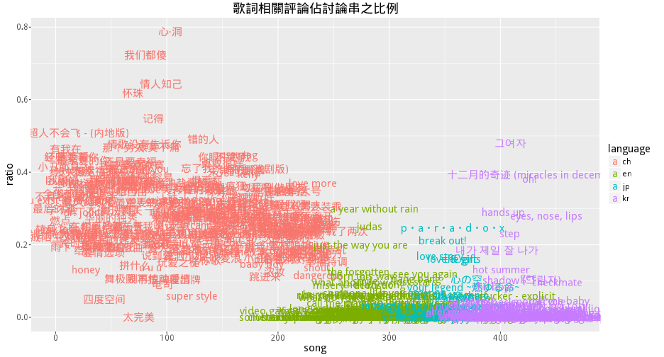
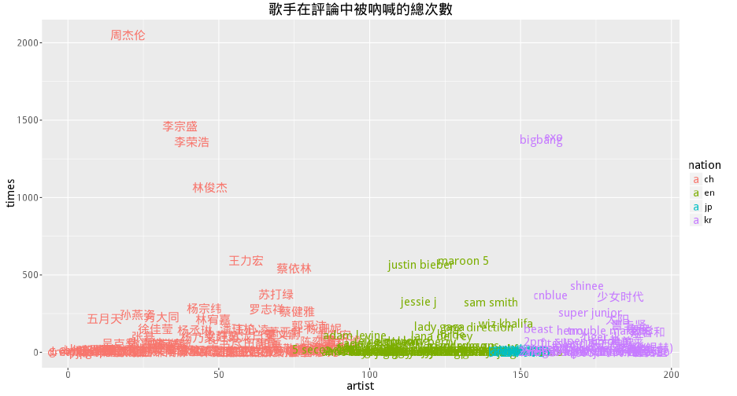
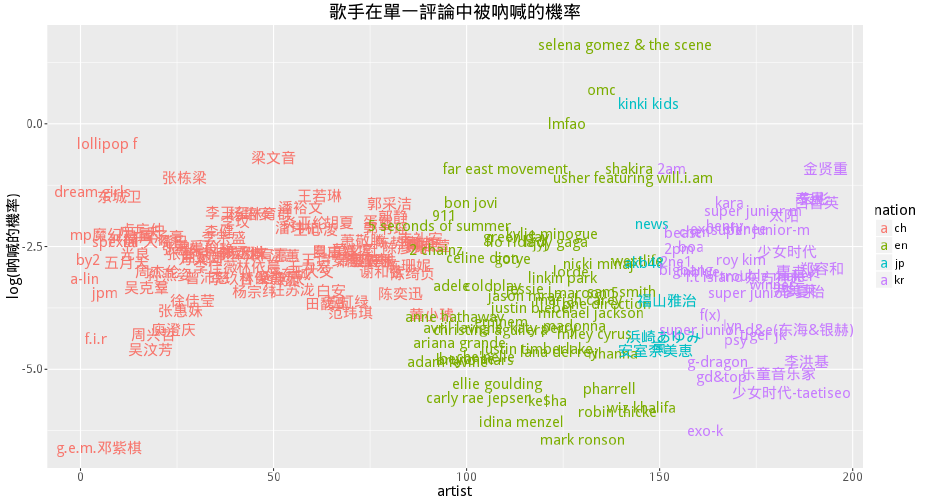
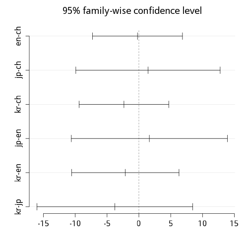
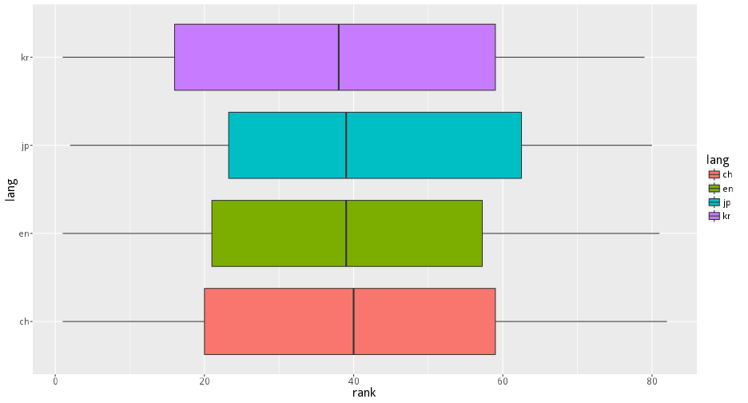
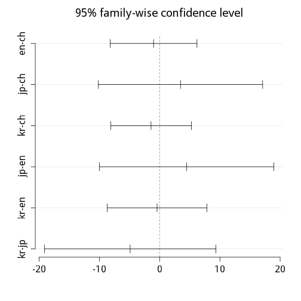
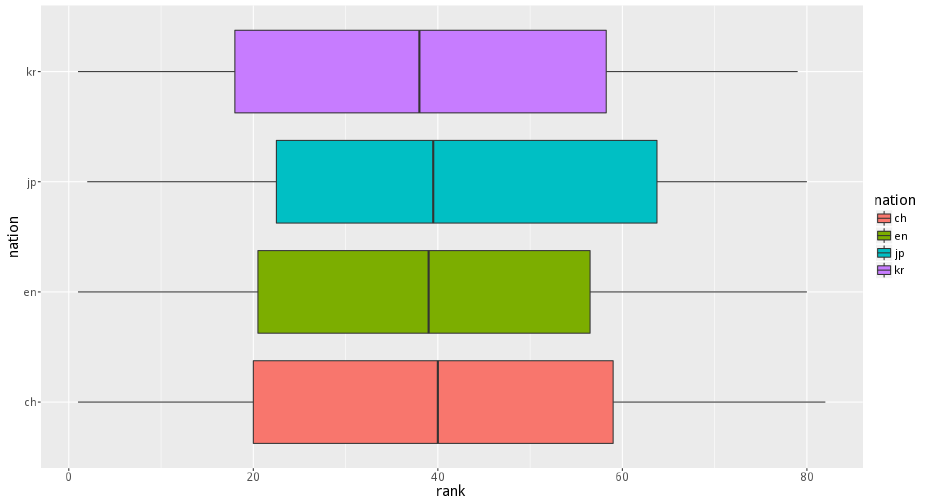
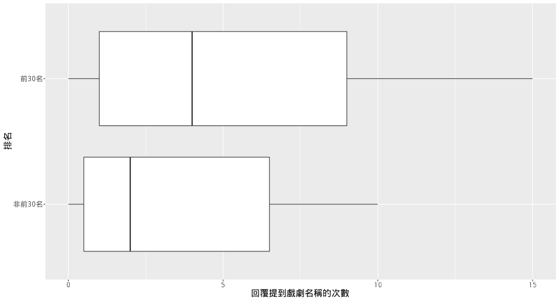

# 研究議題
目前國外對於歌詞的語言分析，多著重在歌詞或旋律帶給聽眾的情緒感受．忽略聽眾對
於歌曲的詮釋，除了情感的面向外．還包括歌曲的社會層面．一首成功熱銷的歌曲，經
常與歌手名氣，當時的流行曲風，熱播戲劇，國家產生連結．近年來大陸和歐美吹起的
韓式K-pop音樂風潮（如少女時代，super junior），就是一個很好的例子．  
<br>
本研究立基在這樣的觀察上，希望透過分析大陸歌曲網站－網易雲－的網友評價，了解
一首歌曲之所以熱門，到底該歸功於它本身引發的情緒共鳴，還是歸功於它的社會條件
．我們研究的社會條件包括歌手名氣，歌手國籍，以及有沒有搭配熱門戲劇．  
<br>
進一步，我們希望把這些歌曲依據語言分成中文組，日文組，韓文組，英文組．探索哪
一種語言的歌，其熱門程度是因為它的社會條件，而非歌曲引發的情緒效果．我們初步
假設，大陸網友對日文歌與韓文歌的喜好程度，主要取決於歌手本人的名氣，國籍，還
有是否搭配熱門戲劇．至於中文和英文歌，則比較是受到歌曲本身引發的情緒所影響．

# 研究假設   
-   KR v.s. JP  
    -   在韓文和日文歌的group中，網友提到電視劇的比例（提到偶像劇的次數／總留言數）與歌曲的排名＂正相關＂．  
    -   在韓文和日文歌的group中，網友提到的情緒用詞比例（提到情緒用詞的數量／總token數），與歌曲排名＂無相關＂．  

# 操作方式
-   **資料來源**：網易雲Hit FM 2010 - 2015 榜單
    -   2015: http://music.163.com/m/playlist?id=148858141
    -   2014: http://music.163.com/m/playlist?id=148822545
    -   2013: http://music.163.com/m/playlist?id=148821771
    -   2012: http://music.163.com/m/playlist?id=148822543
    -   2011: http://music.163.com/m/playlist?id=148813956
    -   2010: http://music.163.com/m/playlist?id=148818810
-   **情緒用詞**：以中研院，大連理工的情緒辭庫當作辭典，抓取網友回覆的情緒用詞比例    
    -   計算每首歌的留言的情緒分數均值／總和
    -   計算每首歌的正負向留言總數／比例
-   **歌手名氣**：由小組中的專家判斷XD
-   **歌手國籍**：由小組成員共同coding
-   **是否與影劇有關**：根據wikipedia的各國電視劇列表，建立辭典，抓取網友回覆提到電視劇的比例．
    -   https://zh.wikipedia.org/zh-cn/韩国电视剧列表
    -   https://zh.wikipedia.org/zh-cn/日本電視劇列表

# 討論
本研究針對韓文和日文歌曲進行排名與情緒還有戲劇名的比較分析．與原先假設不同，
我們發現韓文歌與韓劇是否相關，不會影響到排名的高低．情緒則與原先預期相同，都
與排名無顯著關係．有趣的是，是否和日劇類相關,則會顯著影響日文歌曲進入前30名
的機率(p<0.1)．顯示對網易云的網友來說，能進到排名前30名的日文歌曲，通常會與
日劇有很強的連結．韓劇則無此現象。     
<br>
在資料探索的過程中，我們發現有些歌手不一定會唱自己國籍的歌，像是韓國團體super 
junior就唱了不少中文歌曲，我們認為這類情形會干擾到我們對歌曲的分組，例如把知
名韓國歌手的中文歌，編碼到中文語言類別，針對這個狀況，我們另外以歌手的國籍進
行分組，分析韓國歌手和日文歌手中，排名與情緒還有戲劇名的關係，結果並沒有顯著
相關，顯示國籍的影響沒有預期中的大。  

# 源代碼


```r
library(ggplot2)
library(RSQLite)
library(jiebaR)
library(data.table)
```

## 匯入資料


```r
conn <- dbConnect(SQLite(), "music163-2.db")
songs <- dbReadTable(conn, "songs")
setDT(songs, key = "id")
dbDisconnect(conn = conn)
```

```
## [1] TRUE
```

```r
rank <- fread("HitFM-hot.tsv", sep = "\t")
songs <- merge(songs, rank[, !c("name", "artist") , with = FALSE], by = "id")
cols <- c("name", "artist", "album", "lyric", "comment")
songs[, (cols) := lapply(.SD, tolower), .SDcols = cols]
songs[, (cols) := lapply(.SD, `Encoding<-`, value = "UTF-8"), .SDcols = cols]

POS <- tolower(readLines("sentiment_dict/POS.txt", encoding = "UTF-8"))
NEG <- tolower(readLines("sentiment_dict/NEG.txt", encoding = "UTF-8"))
emoji <- tolower(readLines("emoji", encoding = "UTF-8"))
```

## 爬 Wiki 的日韓電視劇（Python）


```python
import re
import requests
from bs4 import BeautifulSoup

p = re.compile(r'\b\w+\b')

r = requests.get('https://zh.wikipedia.org/zh-cn/韩国电视剧列表')
s = BeautifulSoup(r.text, 'lxml')
TV_kr = {x2 for x in s.select('.NavFrame li') for x2 in p.findall(x.text)}
with open('TV_kr', 'w') as f:
    for show in TV_kr:
        f.write(show + '\n')

r = requests.get('https://zh.wikipedia.org/zh-cn/日本電視劇列表')
s = BeautifulSoup(r.text, 'lxml')
TV_jp = {x2 for x in s.select('.NavFrame li') for x2 in p.findall(x.text)}
with open('TV_jp', 'w') as f:
    for show in TV_jp:
        f.write(show + '\n')

```

```r
TV_kr <- tolower(readLines("TV_kr", encoding = "UTF-8"))
TV_jp <- tolower(readLines("TV_jp", encoding = "UTF-8"))
```

## 將情緒用詞、emoji、影劇名、加入jieba字典庫


```r
fpath <- gsub("jieba\\.", "user.", jiebaR::DICTPATH)
lapply(mget(c("TV_kr", "TV_jp", "POS", "NEG", "emoji")), write, file = fpath)
```

## 斷詞、計算留言數


```r
SEG <- worker()
p1 <- "\\[(.*?)\\]\\s+作[词曲](.*?)\n"
p2 <- "\\[\\d+:\\d+.\\d+\\](.*?)\n"

songs[, `:=`(
    cmmt_seg = lapply(comment, function(x) SEG <= x),
    lyric_seg = lapply(lyric,
        function(x) SEG <= gsub(p2, "\\1 ", gsub(p1, "", x))),
    cmmt_number = sapply(comment,
        function(x) length(unlist(strsplit(x, "<|>", fixed = TRUE))), 
        USE.NAMES = FALSE)
    )]
```

## 計算歌詞相關評論佔討論串的比例 


```r
songs[, r_lyricCmmt := mean(unlist(cmmt_seg) %in% unlist(lyric_seg)), by = .(id, name)]
model <- aov(r_lyricCmmt ~ lang, data = songs)
summary(model)
```

```
##              Df Sum Sq Mean Sq F value Pr(>F)    
## lang          3  7.131  2.3771   281.2 <2e-16 ***
## Residuals   460  3.888  0.0085                   
## ---
## Signif. codes:  0 '***' 0.001 '**' 0.01 '*' 0.05 '.' 0.1 ' ' 1
## 2 observations deleted due to missingness
```

```r
TukeyHSD(model)
```

```
##   Tukey multiple comparisons of means
##     95% family-wise confidence level
## 
## Fit: aov(formula = r_lyricCmmt ~ lang, data = songs)
## 
## $lang
##               diff         lwr         upr     p adj
## en-ch -0.252620172 -0.28121410 -0.22402625 0.0000000
## jp-ch -0.233590139 -0.27947558 -0.18770470 0.0000000
## kr-ch -0.247952356 -0.27654628 -0.21935843 0.0000000
## jp-en  0.019030033 -0.03055467  0.06861474 0.7554633
## kr-en  0.004667816 -0.02954888  0.03888451 0.9850536
## kr-jp -0.014362217 -0.06394693  0.03522249 0.8779917
```

```r
g <- ggplot(songs[order(lang)]) + 
    geom_text(aes(seq_len(nrow(songs)), r_lyricCmmt, label = name, color = lang)) +
    labs(color = "language", x = "song", y = "ratio") +
    ggtitle("歌詞相關評論佔討論串之比例")
print(g)
```

 

## 排名與評論數相關性


```r
cor.test(songs$rank, songs$cmmt_number, method = "kendall")# use kendall to handle ties
```

```
## 
## 	Kendall's rank correlation tau
## 
## data:  songs$rank and songs$cmmt_number
## z = -1.2656, p-value = 0.2057
## alternative hypothesis: true tau is not equal to 0
## sample estimates:
##         tau 
## -0.03948705
```

### 小結：除了中文歌以外，其他語種的歌雖然大多有翻譯歌詞，但鮮少與歌詞共鳴。
## 計算歌手名在評論中被吶喊的次數


```r
songs[, artist_N := length(gregexpr(artist, comment, fixed = TRUE)[[1]]), by = id]
songs[, artist_seg := regmatches(artist, gregexpr("(\\b\\S+\\b)", artist))]
songs[, artist_seg_N := sum(sapply(unlist(artist_seg), function(x) 
    length(gregexpr(x, gsub(artist, "", comment, fixed = TRUE), fixed = TRUE)[[1]]))), by = id]
songs[, artist_sumN := sum(artist_N, artist_seg_N), by = id]
```

```r
g <- ggplot(songs[, .(N = sum(artist_sumN)), keyby = .(nation, artist)]) +
    geom_text(aes(seq_along(artist), N , label = artist, color = nation)) +
    labs(x = "artist", y = "times") +
    ggtitle("歌手在評論中被吶喊的總次數")
print(g)
```

 

```r
g <- ggplot(songs[, .(N = log(sum(artist_sumN)/ sum(cmmt_number))), keyby = .(nation, artist)]) +
    geom_text(aes(seq_along(artist), N , label = artist, color = nation)) +
    labs(x = "artist", y = "log(吶喊的機率)") +
    ggtitle("歌手在單一評論中被吶喊的機率")
print(g)
```

 

## 排名與歌手在單一評論中被吶喊的機率相關性


```r
cor.test(songs[-254, rank], songs[-254, artist_sumN / cmmt_number], method = "kendall")
```

```
## 
## 	Kendall's rank correlation tau
## 
## data:  songs[-254, rank] and songs[-254, artist_sumN/cmmt_number]
## z = 1.7578, p-value = 0.07878
## alternative hypothesis: true tau is not equal to 0
## sample estimates:
##        tau 
## 0.05489566
```

## 排名與歌手本身相關性


```r
which(coef(summary(lm(rank ~ artist, data = songs)))[, 'Pr(>|t|)'] < 0.1)
```

```
## (Intercept) 
##           1
```

```r
summary(lm(artist_sumN ~ nation, data = songs))
```

```
## 
## Call:
## lm(formula = artist_sumN ~ nation, data = songs)
## 
## Residuals:
##     Min      1Q  Median      3Q     Max 
##  -52.70  -46.75  -35.57   -0.90 1408.25 
## 
## Coefficients:
##             Estimate Std. Error t value Pr(>|t|)    
## (Intercept)   49.753      7.194   6.916 1.56e-11 ***
## nationen     -11.182     13.783  -0.811   0.4176    
## nationjp     -46.853     26.089  -1.796   0.0732 .  
## nationkr       4.943     12.808   0.386   0.6997    
## ---
## Signif. codes:  0 '***' 0.001 '**' 0.01 '*' 0.05 '.' 0.1 ' ' 1
## 
## Residual standard error: 112.1 on 462 degrees of freedom
## Multiple R-squared:  0.009175,	Adjusted R-squared:  0.002741 
## F-statistic: 1.426 on 3 and 462 DF,  p-value: 0.2344
```

### 小結:由此看出，日本歌手的評論中較少提及歌手本身(P < 0.1) ，其餘國籍則不顯著。
## 情感分析：運用情緒字典，計算情感分數


```r
songs[, `:=`(
    POS_score = sapply(cmmt_seg, function(x) sum(x %in% POS)),
    POS_lyric = sapply(lyric_seg, function(x) sum(x %in% POS)),
    NEG_score = sapply(cmmt_seg, function(x) sum(x %in% NEG)),
    NEG_lyric = sapply(lyric_seg, function(x) sum(x %in% NEG))
    )]
```

## 排名與評論情緒相關性


```r
cor.test(songs$rank, songs[, POS_score - NEG_score], method = "kendall")
```

```
## 
## 	Kendall's rank correlation tau
## 
## data:  songs$rank and songs[, POS_score - NEG_score]
## z = 0.36937, p-value = 0.7119
## alternative hypothesis: true tau is not equal to 0
## sample estimates:
##        tau 
## 0.01170018
```

```r
cor.test(songs$POS_score, songs$NEG_score, method = "kendall") # postive emotion is significantly associated with negative emotion
```

```
## 
## 	Kendall's rank correlation tau
## 
## data:  songs$POS_score and songs$NEG_score
## z = 24.326, p-value < 2.2e-16
## alternative hypothesis: true tau is not equal to 0
## sample estimates:
##       tau 
## 0.7759151
```

```r
cor.test(songs$rank, songs$NEG_score, method = "kendall")
```

```
## 
## 	Kendall's rank correlation tau
## 
## data:  songs$rank and songs$NEG_score
## z = -1.3863, p-value = 0.1656
## alternative hypothesis: true tau is not equal to 0
## sample estimates:
##         tau 
## -0.04393589
```

```r
cor.test(songs$rank, songs$POS_score, method = "kendall")
```

```
## 
## 	Kendall's rank correlation tau
## 
## data:  songs$rank and songs$POS_score
## z = -0.78137, p-value = 0.4346
## alternative hypothesis: true tau is not equal to 0
## sample estimates:
##         tau 
## -0.02462878
```

## 排名與語種相關性


```r
model <- aov(rank ~ lang, data = songs)
summary(model)
```

```
##              Df Sum Sq Mean Sq F value Pr(>F)
## lang          3    510   169.9   0.329  0.805
## Residuals   462 238693   516.7
```

```r
TukeyHSD(model)
```

```
##   Tukey multiple comparisons of means
##     95% family-wise confidence level
## 
## Fit: aov(formula = rank ~ lang, data = songs)
## 
## $lang
##             diff        lwr       upr     p adj
## en-ch -0.2154064  -7.280388  6.849575 0.9998256
## jp-ch  1.4325103  -9.908911 12.773931 0.9880589
## kr-ch -2.3465275  -9.385356  4.692301 0.8256444
## jp-en  1.6479167 -10.610629 13.906462 0.9856796
## kr-en -2.1311211 -10.568491  6.306249 0.9150887
## kr-jp -3.7790378 -16.022529  8.464454 0.8563201
```

```r
plot(TukeyHSD(model))
```

 

```r
g <- ggplot(songs) + geom_boxplot(aes(lang, rank, fill = lang)) + coord_flip()
print(g)
```

 

## 排名與國籍相關性


```r
model <- aov(rank ~ nation, data = songs)
summary(model)
```

```
##              Df Sum Sq Mean Sq F value Pr(>F)
## nation        3    490   163.2   0.316  0.814
## Residuals   462 238713   516.7
```

```r
TukeyHSD(model)
```

```
##   Tukey multiple comparisons of means
##     95% family-wise confidence level
## 
## Fit: aov(formula = rank ~ nation, data = songs)
## 
## $nation
##             diff        lwr       upr     p adj
## en-ch -1.0056528  -8.208720  6.197414 0.9840145
## jp-ch  3.4652263 -10.168915 17.099368 0.9136556
## kr-ch -1.4294165  -8.123176  5.264343 0.9463636
## jp-en  4.4708791 -10.003297 18.945055 0.8560476
## kr-en -0.4237637  -8.695304  7.847776 0.9991762
## kr-jp -4.8946429 -19.122222  9.332936 0.8116090
```

```r
plot(TukeyHSD(model))
```

 

```r
g <- ggplot(songs) + geom_boxplot(aes(nation, rank, fill = nation)) + coord_flip()
print(g)
```

 

## 排名與影劇相關性


```r
songs[, `:=`(
        kr_score = sapply(cmmt_seg, function(x) sum(x %in% TV_kr)),
        jp_score = sapply(cmmt_seg, function(x) sum(x %in% TV_jp))
    )]

cor.test(songs$kr_score, songs$jp_score, method = "kendall")
```

```
## 
## 	Kendall's rank correlation tau
## 
## data:  songs$kr_score and songs$jp_score
## z = 20.868, p-value < 2.2e-16
## alternative hypothesis: true tau is not equal to 0
## sample estimates:
##       tau 
## 0.6998253
```

```r
cor.test(songs$rank, songs$kr_score, method = "kendall")
```

```
## 
## 	Kendall's rank correlation tau
## 
## data:  songs$rank and songs$kr_score
## z = -0.85724, p-value = 0.3913
## alternative hypothesis: true tau is not equal to 0
## sample estimates:
##         tau 
## -0.02794321
```

```r
cor.test(songs$rank, songs$jp_score, method = "kendall")
```

```
## 
## 	Kendall's rank correlation tau
## 
## data:  songs$rank and songs$jp_score
## z = -0.66307, p-value = 0.5073
## alternative hypothesis: true tau is not equal to 0
## sample estimates:
##         tau 
## -0.02136333
```

## 檢查
### 評論出現韓劇次數 > 20 的 歌手與歌曲


|name                        |artist                      |
|:---------------------------|:---------------------------|
|心电心                      |王心凌                      |
|我很好，那么你呢？          |王心凌                      |
|我不愿让你一个人            |五月天                      |
|忘记拥抱                    |潘玮柏                      |
|skyfall                     |adele                       |
|one time                    |justin bieber               |
|nu 예삐오 (nu abo)          |f(x)                        |
|좋겠어 (i wish)             |f.t island                  |
|my love                     |田馥甄                      |
|孤独患者                    |陈奕迅                      |
|你不知道的事                |王力宏                      |
|i dreamed a dream           |anne hathaway               |
|修炼爱情                    |林俊杰                      |
|错的人                      |萧亚轩                      |
|here's to never growing up  |avril lavigne               |
|一念之间                    |陶喆                        |
|山丘                        |李宗盛                      |
|roar                        |katy perry                  |
|쿠데타 (coup d'etat)        |g-dragon                    |
|loved me back to life       |celine dion                 |
|링가 링가 (ringa linga)     |太阳                        |
|drunk in love (feat. jay z) |beyoncé                     |
|天使的指纹                  |孙燕姿                      |
|swing                       |super junior m              |
|love someone                |jason mraz                  |
|holler                      |少女时代-taetiseo           |
|steal my girl               |one direction               |
|点水                        |杨丞琳                      |
|living for love             |madonna                     |
|裂心                        |王力宏                      |
|孤独的总和                  |吴汶芳                      |
|너는 나만큼 (growing pains) |super junior-d&e(东海&银赫) |
|see you again               |wiz khalifa                 |
|photogenic                  |安室奈美恵                  |
|i am a hero                 |福山雅治                    |
|再见                        |g.e.m.邓紫棋                |

### 評論出現日劇次數 > 20 的 歌手與歌曲


|name                        |artist                      |
|:---------------------------|:---------------------------|
|胡闹                        |吴克羣                      |
|诗人漫步                    |蔡依林                      |
|最亲爱的你                  |范玮琪                      |
|心电心                      |王心凌                      |
|我很好，那么你呢？          |王心凌                      |
|你敢不敢                    |徐佳莹                      |
|逞强                        |萧亚轩                      |
|我不愿让你一个人            |五月天                      |
|paparazzi                   |少女时代                    |
|忘记拥抱                    |潘玮柏                      |
|one time                    |justin bieber               |
|nu 예삐오 (nu abo)          |f(x)                        |
|lucifer                     |shinee                      |
|依然爱你                    |王力宏                      |
|my love                     |田馥甄                      |
|哪里都是你                  |周杰伦                      |
|你不知道的事                |王力宏                      |
|公公偏头痛                  |周杰伦                      |
|i dreamed a dream           |anne hathaway               |
|修炼爱情                    |林俊杰                      |
|其实都没有                  |杨宗纬                      |
|爱不单行                    |罗志祥                      |
|错的人                      |萧亚轩                      |
|here's to never growing up  |avril lavigne               |
|一念之间                    |陶喆                        |
|山丘                        |李宗盛                      |
|쿠데타 (coup d'etat)        |g-dragon                    |
|loved me back to life       |celine dion                 |
|不哭了                      |by2                         |
|everybody                   |shinee                      |
|drunk in love (feat. jay z) |beyoncé                     |
|像天堂的悬崖                |李佳薇                      |
|swing                       |super junior m              |
|特别的人                    |方大同                      |
|love someone                |jason mraz                  |
|小丑                        |潘玮柏                      |
|lost stars                  |adam levine                 |
|这样你还要爱我吗            |张惠妹                      |
|缺口                        |庾澄庆                      |
|不解释亲吻                  |萧亚轩                      |
|this is love                |super junior                |
|미친거 아니야?              |2pm                         |
|steal my girl               |one direction               |
|광화문에서 (at gwanghwamun) |曺圭贤                      |
|失忆的金鱼                  |杨丞琳                      |
|点水                        |杨丞琳                      |
|living for love             |madonna                     |
|多年后                      |曾沛慈                      |
|鞋子特大号                  |周杰伦                      |
|算什么男人                  |周杰伦                      |
|裂心                        |王力宏                      |
|孤独的总和                  |吴汶芳                      |
|너는 나만큼 (growing pains) |super junior-d&e(东海&银赫) |
|母系社会                    |张惠妹                      |

檢查後發現，因為有些日韓影劇名稱太過大眾化，容易出現在網友的留言中，以至於有
不少提到影劇名稱多次的歌曲，與這些影劇沒有直接關係．是本研究的限制之一。這也
是為何我們後面要把歌曲根據語言或國籍做分組，目的是要在分析時，盡量排除那些與
日韓影劇沒有直接關係的歌曲樣本。   

## 分語言分析排名與日韓影劇的相關性


```r
table(songs$lang)
```

```
## 
##  ch  en  jp  kr 
## 243  96  30  97
```

```r
songs_kr <- songs[lang == 'kr']
songs_jp <- songs[lang == 'jp']

cor.test(songs_kr$rank, songs_kr$kr_score, method = "kendall")
```

```
## 
## 	Kendall's rank correlation tau
## 
## data:  songs_kr$rank and songs_kr$kr_score
## z = 0.19804, p-value = 0.843
## alternative hypothesis: true tau is not equal to 0
## sample estimates:
##       tau 
## 0.0142482
```

```r
cor.test(songs_jp$rank, songs_jp$jp_score, method = "kendall")
```

```
## 
## 	Kendall's rank correlation tau
## 
## data:  songs_jp$rank and songs_jp$jp_score
## z = 1.4247, p-value = 0.1542
## alternative hypothesis: true tau is not equal to 0
## sample estimates:
##       tau 
## 0.1905214
```

```r
lbl <- c("非前30名", "前30名")
songs_kr[, rank_two := factor(ifelse(rank >= 30, 1, 0), labels = lbl)]
songs_jp[, rank_two := factor(ifelse(rank >= 30, 1, 0), labels = lbl)]

model <- aov(kr_score ~ rank_two, data = songs_kr)
summary(model)
```

```
##             Df Sum Sq Mean Sq F value Pr(>F)
## rank_two     1      2    2.44   0.044  0.834
## Residuals   95   5246   55.22
```

```r
model <- aov(jp_score ~ rank_two, data = songs_jp)
summary(model) # jp_score is moderately associated with top30 rank or not in japanese language group
```

```
##             Df Sum Sq Mean Sq F value Pr(>F)
## rank_two     1   35.1   35.08   1.424  0.243
## Residuals   28  689.9   24.64
```

```r
g <- ggplot(songs_jp) + 
    geom_boxplot(aes(rank_two, jp_score, group = rank_two)) +
    xlab("排名") +
    ylab("回覆提到戲劇名稱的次數") +
    coord_flip()
print(g)
```

 

## 分語言分析排名與情緒的相關性(加入中文英文歌的分群)


```r
cor.test(songs_kr$rank, songs_kr[, POS_score - NEG_score], method = "kendall")
```

```
## 
## 	Kendall's rank correlation tau
## 
## data:  songs_kr$rank and songs_kr[, POS_score - NEG_score]
## z = 0.78251, p-value = 0.4339
## alternative hypothesis: true tau is not equal to 0
## sample estimates:
##        tau 
## 0.05553452
```

```r
cor.test(songs_kr$rank, songs_kr$NEG_score, method = "kendall")
```

```
## 
## 	Kendall's rank correlation tau
## 
## data:  songs_kr$rank and songs_kr$NEG_score
## z = -0.18756, p-value = 0.8512
## alternative hypothesis: true tau is not equal to 0
## sample estimates:
##         tau 
## -0.01325162
```

```r
cor.test(songs_kr$rank, songs_kr$POS_score, method = "kendall")
```

```
## 
## 	Kendall's rank correlation tau
## 
## data:  songs_kr$rank and songs_kr$POS_score
## z = 0.409, p-value = 0.6825
## alternative hypothesis: true tau is not equal to 0
## sample estimates:
##        tau 
## 0.02871077
```

```r
cor.test(songs_jp$rank, songs_jp[, POS_score - NEG_score], method = "kendall")
```

```
## 
## 	Kendall's rank correlation tau
## 
## data:  songs_jp$rank and songs_jp[, POS_score - NEG_score]
## z = 0.80885, p-value = 0.4186
## alternative hypothesis: true tau is not equal to 0
## sample estimates:
##       tau 
## 0.1071866
```

```r
cor.test(songs_jp$rank, songs_jp$NEG_score, method = "kendall")
```

```
## 
## 	Kendall's rank correlation tau
## 
## data:  songs_jp$rank and songs_jp$NEG_score
## z = 0.28718, p-value = 0.774
## alternative hypothesis: true tau is not equal to 0
## sample estimates:
##        tau 
## 0.03797145
```

```r
cor.test(songs_jp$rank, songs_jp$POS_score, method = "kendall")
```

```
## 
## 	Kendall's rank correlation tau
## 
## data:  songs_jp$rank and songs_jp$POS_score
## z = 0.86464, p-value = 0.3872
## alternative hypothesis: true tau is not equal to 0
## sample estimates:
##      tau 
## 0.114897
```

```r
songs_ch <- songs[lang == 'ch']
songs_en <- songs[lang == 'en']

cor.test(songs_ch$rank, songs_ch[, POS_score - NEG_score], method = "kendall")
```

```
## 
## 	Kendall's rank correlation tau
## 
## data:  songs_ch$rank and songs_ch[, POS_score - NEG_score]
## z = -0.41877, p-value = 0.6754
## alternative hypothesis: true tau is not equal to 0
## sample estimates:
##         tau 
## -0.01833537
```

```r
cor.test(songs_ch$rank, songs_ch$NEG_score, method = "kendall")
```

```
## 
## 	Kendall's rank correlation tau
## 
## data:  songs_ch$rank and songs_ch$NEG_score
## z = -1.3175, p-value = 0.1877
## alternative hypothesis: true tau is not equal to 0
## sample estimates:
##         tau 
## -0.05773732
```

```r
cor.test(songs_ch$rank, songs_ch$POS_score, method = "kendall")
```

```
## 
## 	Kendall's rank correlation tau
## 
## data:  songs_ch$rank and songs_ch$POS_score
## z = -1.1485, p-value = 0.2507
## alternative hypothesis: true tau is not equal to 0
## sample estimates:
##         tau 
## -0.05007501
```

```r
cor.test(songs_en$rank, songs_en[, POS_score - NEG_score], method = "kendall")
```

```
## 
## 	Kendall's rank correlation tau
## 
## data:  songs_en$rank and songs_en[, POS_score - NEG_score]
## z = 0.46398, p-value = 0.6427
## alternative hypothesis: true tau is not equal to 0
## sample estimates:
##        tau 
## 0.03307954
```

```r
cor.test(songs_en$rank, songs_en$NEG_score, method = "kendall")
```

```
## 
## 	Kendall's rank correlation tau
## 
## data:  songs_en$rank and songs_en$NEG_score
## z = -1.0676, p-value = 0.2857
## alternative hypothesis: true tau is not equal to 0
## sample estimates:
##         tau 
## -0.07584682
```

```r
cor.test(songs_en$rank, songs_en$POS_score, method = "kendall")
```

```
## 
## 	Kendall's rank correlation tau
## 
## data:  songs_en$rank and songs_en$POS_score
## z = -1.0381, p-value = 0.2992
## alternative hypothesis: true tau is not equal to 0
## sample estimates:
##         tau 
## -0.07350227
```

## Logistic regression for Janpanese language songs (top30 or not) 


```r
fit <- glm(rank_two ~ POS_score + NEG_score + jp_score, data = songs_jp, family = binomial)
summary(fit)
```

```
## 
## Call:
## glm(formula = rank_two ~ POS_score + NEG_score + jp_score, family = binomial, 
##     data = songs_jp)
## 
## Deviance Residuals: 
##    Min      1Q  Median      3Q     Max  
## -1.963  -1.219   0.675   1.027   1.274  
## 
## Coefficients:
##              Estimate Std. Error z value Pr(>|z|)
## (Intercept) -0.002441   0.539292  -0.005    0.996
## POS_score    0.047569   0.062895   0.756    0.449
## NEG_score   -0.111307   0.123701  -0.900    0.368
## jp_score     0.193367   0.157593   1.227    0.220
## 
## (Dispersion parameter for binomial family taken to be 1)
## 
##     Null deviance: 39.429  on 29  degrees of freedom
## Residual deviance: 37.043  on 26  degrees of freedom
## AIC: 45.043
## 
## Number of Fisher Scoring iterations: 4
```

## Regression
### 榜單名次 = 歌手ｘ評論數ｘ情緒分數ｘ日韓影劇　回歸分析


```r
fit <- lm(rank ~ artist + cmmt_number + POS_score + NEG_score + jp_score, data = songs_jp)
summary(fit)
```

```
## 
## Call:
## lm(formula = rank ~ artist + cmmt_number + POS_score + NEG_score + 
##     jp_score, data = songs_jp)
## 
## Residuals:
##     Min      1Q  Median      3Q     Max 
## -34.965   0.000   0.000   4.986  33.446 
## 
## Coefficients:
##                     Estimate Std. Error t value Pr(>|t|)
## (Intercept)         34.44463   26.19811   1.315    0.221
## artistakb48        -10.20478   30.36761  -0.336    0.745
## artistbigbang      -36.78283   38.99942  -0.943    0.370
## artistcnblue       -43.78502   56.71316  -0.772    0.460
## artistkinki kids   -13.62629   36.96018  -0.369    0.721
## artistnews         -34.32027   43.04091  -0.797    0.446
## artistshinee        17.85436   45.39590   0.393    0.703
## artistsuper junior  15.51545   37.14821   0.418    0.686
## artistwinner        15.75533   38.12492   0.413    0.689
## artist东方神起      13.82948   32.60848   0.424    0.681
## artist五月天       -13.24017   44.18593  -0.300    0.771
## artist安室奈美恵    20.36851   40.12959   0.508    0.624
## artist少女时代      -8.88757   37.00171  -0.240    0.816
## artist嵐             5.00768   28.98000   0.173    0.867
## artist浜崎あゆみ     7.84560   32.03984   0.245    0.812
## artist福山雅治       4.95650   44.50982   0.111    0.914
## artist罗志祥       -27.59000   36.78598  -0.750    0.472
## cmmt_number          0.04537    0.05434   0.835    0.425
## POS_score            0.40387    1.28817   0.314    0.761
## NEG_score           -1.90909    2.72406  -0.701    0.501
## jp_score             2.37141    2.92307   0.811    0.438
## 
## Residual standard error: 25.93 on 9 degrees of freedom
## Multiple R-squared:  0.6174,	Adjusted R-squared:  -0.233 
## F-statistic: 0.726 on 20 and 9 DF,  p-value: 0.7378
```

```r
fit <- lm(rank ~ artist + cmmt_number + POS_score + NEG_score + kr_score, data = songs_kr)
summary(fit)
```

```
## 
## Call:
## lm(formula = rank ~ artist + cmmt_number + POS_score + NEG_score + 
##     kr_score, data = songs_kr)
## 
## Residuals:
##     Min      1Q  Median      3Q     Max 
## -36.765  -8.142   0.000   9.915  39.531 
## 
## Coefficients:
##                                     Estimate Std. Error t value Pr(>|t|)  
## (Intercept)                       17.5371409 20.9174616   0.838   0.4054  
## artist2pm                         29.5367708 23.5921681   1.252   0.2158  
## artistbeast                       27.2005116 23.4745061   1.159   0.2515  
## artistbigbang                     28.1110776 24.4032976   1.152   0.2542  
## artistboa                         40.7522922 30.0972582   1.354   0.1812  
## artistchen                        19.2883466 29.8646737   0.646   0.5210  
## artistcnblue                      10.9723096 22.9162167   0.479   0.6339  
## artistexo                         16.9964462 25.5726513   0.665   0.5090  
## artistexo-k                       -0.4176759 29.6469640  -0.014   0.9888  
## artistf.t island                  20.7744891 22.6635613   0.917   0.3633  
## artistf(x)                        17.4092172 23.7789131   0.732   0.4671  
## artistg-dragon                    30.3460310 28.6257098   1.060   0.2937  
## artistgd&top                      40.1553535 30.5153390   1.316   0.1936  
## artisthenry                       35.2920144 26.0638909   1.354   0.1812  
## artistkara                        53.3745324 29.5551497   1.806   0.0763 .
## artistlyn                         -5.4757345 29.6724025  -0.185   0.8543  
## artistpsy                         -5.1643529 25.6474071  -0.201   0.8411  
## artistroy kim                     53.4166062 25.8705449   2.065   0.0436 *
## artistshinee                      14.9329886 23.2086939   0.643   0.5226  
## artistsuper junior                -2.5796486 22.1987492  -0.116   0.9079  
## artistsuper junior-d&e(东海&银赫)  5.9717810 25.9889467   0.230   0.8191  
## artisttiger jk                    56.5135490 33.7578790   1.674   0.0997 .
## artisttrouble maker               50.1015284 25.7629326   1.945   0.0568 .
## artist东方神起                    25.5953764 25.7358969   0.995   0.3242  
## artist尹美莱                       6.3567963 29.9375234   0.212   0.8326  
## artist乐童音乐家                  60.2198699 29.7475866   2.024   0.0477 *
## artist太阳                        17.5688981 26.1433030   0.672   0.5043  
## artist少女时代                    14.0293736 22.1021009   0.635   0.5282  
## artist少女时代-taetiseo           15.9561226 26.8834678   0.594   0.5552  
## artist曺圭贤                      28.0615285 27.0838897   1.036   0.3046  
## artist李夏怡                      -2.8009446 29.7478571  -0.094   0.9253  
## artist李洪基                       6.7449560 25.9071884   0.260   0.7955  
## artist泰民                        34.4161608 29.5578590   1.164   0.2492  
## artist玄彬                        -8.2727641 29.9977453  -0.276   0.7837  
## artist白智英                      62.1221662 29.8114111   2.084   0.0418 *
## artist郑容和                      -3.7901630 24.2557958  -0.156   0.8764  
## artist金贤重                      52.1806324 29.5297095   1.767   0.0827 .
## cmmt_number                       -0.0002042  0.0021310  -0.096   0.9240  
## POS_score                          0.4883359  0.3177081   1.537   0.1299  
## NEG_score                         -0.7167524  0.3944391  -1.817   0.0745 .
## kr_score                           0.0451842  0.5108040   0.088   0.9298  
## ---
## Signif. codes:  0 '***' 0.001 '**' 0.01 '*' 0.05 '.' 0.1 ' ' 1
## 
## Residual standard error: 20.87 on 56 degrees of freedom
## Multiple R-squared:  0.5347,	Adjusted R-squared:  0.2024 
## F-statistic: 1.609 on 40 and 56 DF,  p-value: 0.04988
```

### 小結:情緒對不同語言歌曲的排名都沒有顯著影響.但是否和日劇類相關,則會顯著影響日文歌曲進入前30名的機率(p<0.1)
## 分國籍分析排名與日韓影劇的相關性


```r
table(songs$nation)
```

```
## 
##  ch  en  jp  kr 
## 243  91  20 112
```

```r
songs_kr <- songs[nation == 'kr']
songs_jp <- songs[nation == 'jp']

cor.test(songs_kr$rank, songs_kr$kr_score, method = "kendall")
```

```
## 
## 	Kendall's rank correlation tau
## 
## data:  songs_kr$rank and songs_kr$kr_score
## z = 0.045676, p-value = 0.9636
## alternative hypothesis: true tau is not equal to 0
## sample estimates:
##         tau 
## 0.003057931
```

```r
cor.test(songs_jp$rank, songs_jp$jp_score, method = "kendall")
```

```
## 
## 	Kendall's rank correlation tau
## 
## data:  songs_jp$rank and songs_jp$jp_score
## z = 1.0826, p-value = 0.279
## alternative hypothesis: true tau is not equal to 0
## sample estimates:
##       tau 
## 0.1819736
```

```r
lbl <- c("非前30名", "前30名")
songs_kr[, rank_two := factor(ifelse(rank >= 30, 1, 0), labels = lbl)]
songs_jp[, rank_two := factor(ifelse(rank >= 30, 1, 0), labels = lbl)]

model <- aov(kr_score ~ rank_two, data = songs_kr)
summary(model)
```

```
##              Df Sum Sq Mean Sq F value Pr(>F)
## rank_two      1      3    2.91   0.053  0.818
## Residuals   110   5978   54.34
```

```r
model <- aov(jp_score ~ rank_two, data = songs_jp)
summary(model)
```

```
##             Df Sum Sq Mean Sq F value Pr(>F)
## rank_two     1   28.1   28.06   0.919   0.35
## Residuals   18  549.7   30.54
```

## 分國籍分析排名與情緒的相關性(加入中文英文歌手的分群)


```r
cor.test(songs_kr$rank, songs_kr[, POS_score - NEG_score], method = "kendall")
```

```
## 
## 	Kendall's rank correlation tau
## 
## data:  songs_kr$rank and songs_kr[, POS_score - NEG_score]
## z = 0.94758, p-value = 0.3433
## alternative hypothesis: true tau is not equal to 0
## sample estimates:
##        tau 
## 0.06258715
```

```r
cor.test(songs_kr$rank, songs_kr$NEG_score, method = "kendall")
```

```
## 
## 	Kendall's rank correlation tau
## 
## data:  songs_kr$rank and songs_kr$NEG_score
## z = -0.41124, p-value = 0.6809
## alternative hypothesis: true tau is not equal to 0
## sample estimates:
##         tau 
## -0.02702882
```

```r
cor.test(songs_kr$rank, songs_kr$POS_score, method = "kendall")
```

```
## 
## 	Kendall's rank correlation tau
## 
## data:  songs_kr$rank and songs_kr$POS_score
## z = 0.2545, p-value = 0.7991
## alternative hypothesis: true tau is not equal to 0
## sample estimates:
##       tau 
## 0.0166189
```

```r
cor.test(songs_jp$rank, songs_jp[, POS_score - NEG_score], method = "kendall")
```

```
## 
## 	Kendall's rank correlation tau
## 
## data:  songs_jp$rank and songs_jp[, POS_score - NEG_score]
## z = 0.032575, p-value = 0.974
## alternative hypothesis: true tau is not equal to 0
## sample estimates:
##         tau 
## 0.005362412
```

```r
cor.test(songs_jp$rank, songs_jp$NEG_score, method = "kendall")
```

```
## 
## 	Kendall's rank correlation tau
## 
## data:  songs_jp$rank and songs_jp$NEG_score
## z = 0.45582, p-value = 0.6485
## alternative hypothesis: true tau is not equal to 0
## sample estimates:
##        tau 
## 0.07487059
```

```r
cor.test(songs_jp$rank, songs_jp$POS_score, method = "kendall")
```

```
## 
## 	Kendall's rank correlation tau
## 
## data:  songs_jp$rank and songs_jp$POS_score
## z = 0.84921, p-value = 0.3958
## alternative hypothesis: true tau is not equal to 0
## sample estimates:
##       tau 
## 0.1405734
```

```r
songs_ch <- songs[nation == 'ch']
songs_en <- songs[nation == 'en']

cor.test(songs_ch$rank, songs_ch[, POS_score - NEG_score], method = "kendall")
```

```
## 
## 	Kendall's rank correlation tau
## 
## data:  songs_ch$rank and songs_ch[, POS_score - NEG_score]
## z = -0.47328, p-value = 0.636
## alternative hypothesis: true tau is not equal to 0
## sample estimates:
##        tau 
## -0.0207174
```

```r
cor.test(songs_ch$rank, songs_ch$NEG_score, method = "kendall")
```

```
## 
## 	Kendall's rank correlation tau
## 
## data:  songs_ch$rank and songs_ch$NEG_score
## z = -1.5041, p-value = 0.1326
## alternative hypothesis: true tau is not equal to 0
## sample estimates:
##         tau 
## -0.06595397
```

```r
cor.test(songs_ch$rank, songs_ch$POS_score, method = "kendall")
```

```
## 
## 	Kendall's rank correlation tau
## 
## data:  songs_ch$rank and songs_ch$POS_score
## z = -1.252, p-value = 0.2106
## alternative hypothesis: true tau is not equal to 0
## sample estimates:
##         tau 
## -0.05459885
```

```r
cor.test(songs_en$rank, songs_en[, POS_score - NEG_score], method = "kendall")
```

```
## 
## 	Kendall's rank correlation tau
## 
## data:  songs_en$rank and songs_en[, POS_score - NEG_score]
## z = 0.67775, p-value = 0.4979
## alternative hypothesis: true tau is not equal to 0
## sample estimates:
##        tau 
## 0.04958522
```

```r
cor.test(songs_en$rank, songs_en$NEG_score, method = "kendall")
```

```
## 
## 	Kendall's rank correlation tau
## 
## data:  songs_en$rank and songs_en$NEG_score
## z = -0.63314, p-value = 0.5266
## alternative hypothesis: true tau is not equal to 0
## sample estimates:
##         tau 
## -0.04618837
```

```r
cor.test(songs_en$rank, songs_en$POS_score, method = "kendall")
```

```
## 
## 	Kendall's rank correlation tau
## 
## data:  songs_en$rank and songs_en$POS_score
## z = -0.59468, p-value = 0.5521
## alternative hypothesis: true tau is not equal to 0
## sample estimates:
##         tau 
## -0.04322277
```

## Regression
### 榜單名次 = 歌手ｘ評論數ｘ情緒分數ｘ日韓影劇　回歸分析


```r
fit <- lm(rank ~ artist + cmmt_number + POS_score + NEG_score + jp_score, data = songs_jp)
summary(fit)
```

```
## 
## Call:
## lm(formula = rank ~ artist + cmmt_number + POS_score + NEG_score + 
##     jp_score, data = songs_jp)
## 
## Residuals:
##     Min      1Q  Median      3Q     Max 
## -35.069  -4.981   2.182  12.011  28.066 
## 
## Coefficients:
##                  Estimate Std. Error t value Pr(>|t|)
## (Intercept)      23.42673   15.27744   1.533    0.160
## artistkinki kids -3.41145   29.52400  -0.116    0.911
## artistnews       -8.61951   42.11077  -0.205    0.842
## artist安室奈美恵 41.67083   33.52959   1.243    0.245
## artist嵐         19.67119   20.42896   0.963    0.361
## artist浜崎あゆみ 24.63197   23.50851   1.048    0.322
## artist福山雅治   35.16466   27.48496   1.279    0.233
## cmmt_number       0.07059    0.05315   1.328    0.217
## POS_score         0.02554    1.32908   0.019    0.985
## NEG_score        -1.15646    2.85329  -0.405    0.695
## jp_score          0.63249    3.29644   0.192    0.852
## 
## Residual standard error: 25.49 on 9 degrees of freedom
## Multiple R-squared:  0.4769,	Adjusted R-squared:  -0.1043 
## F-statistic: 0.8206 on 10 and 9 DF,  p-value: 0.6211
```

```r
fit <- lm(rank ~ artist + cmmt_number + POS_score + NEG_score + kr_score, data = songs_kr)
summary(fit)
```

```
## 
## Call:
## lm(formula = rank ~ artist + cmmt_number + POS_score + NEG_score + 
##     kr_score, data = songs_kr)
## 
## Residuals:
##     Min      1Q  Median      3Q     Max 
## -36.732  -8.408   0.000   8.945  38.717 
## 
## Coefficients:
##                                     Estimate Std. Error t value Pr(>|t|)  
## (Intercept)                        3.696e+01  2.095e+01   1.764   0.0822 .
## artist2ne1                        -1.917e+01  2.959e+01  -0.648   0.5192  
## artist2pm                          9.954e+00  2.350e+01   0.424   0.6732  
## artistbeast                        7.457e+00  2.347e+01   0.318   0.7517  
## artistbigbang                      1.850e+00  2.351e+01   0.079   0.9375  
## artistboa                          2.083e+01  3.011e+01   0.692   0.4915  
## artistchen                        -2.956e-01  2.987e+01  -0.010   0.9921  
## artistcnblue                      -9.800e+00  2.262e+01  -0.433   0.6663  
## artistexo                         -4.282e+00  2.422e+01  -0.177   0.8602  
## artistexo-k                       -2.047e+01  2.972e+01  -0.689   0.4935  
## artistf.t island                   1.253e+00  2.266e+01   0.055   0.9560  
## artistf(x)                        -2.082e+00  2.359e+01  -0.088   0.9299  
## artistg-dragon                     1.247e+01  2.915e+01   0.428   0.6701  
## artistgd&top                       1.857e+01  3.039e+01   0.611   0.5433  
## artisthenry                        1.522e+01  2.599e+01   0.586   0.5600  
## artistkara                         3.399e+01  2.955e+01   1.150   0.2542  
## artistlyn                         -2.548e+01  2.978e+01  -0.855   0.3954  
## artistpsy                         -2.483e+01  2.562e+01  -0.969   0.3360  
## artistroy kim                      3.360e+01  2.579e+01   1.303   0.1972  
## artistshinee                      -6.873e-01  2.295e+01  -0.030   0.9762  
## artistsuper junior                -1.845e+01  2.199e+01  -0.839   0.4044  
## artistsuper junior m               7.084e+00  2.344e+01   0.302   0.7634  
## artistsuper junior-d&e(东海&银赫) -1.382e+01  2.591e+01  -0.533   0.5955  
## artistsuper junior-m               1.970e+01  2.956e+01   0.666   0.5075  
## artisttiger jk                     3.287e+01  3.287e+01   1.000   0.3210  
## artisttrouble maker                3.006e+01  2.586e+01   1.162   0.2492  
## artistwinner                       2.779e+01  2.960e+01   0.939   0.3512  
## artist东方神起                     1.240e+01  2.345e+01   0.529   0.5989  
## artist尹美莱                      -1.401e+01  2.999e+01  -0.467   0.6420  
## artist乐童音乐家                   3.980e+01  2.976e+01   1.337   0.1856  
## artist太阳                        -2.529e+00  2.598e+01  -0.097   0.9227  
## artist少女时代                    -6.236e+00  2.196e+01  -0.284   0.7773  
## artist少女时代-taetiseo           -3.815e+00  2.649e+01  -0.144   0.8859  
## artist曺圭贤                       7.902e+00  2.716e+01   0.291   0.7720  
## artist李夏怡                      -2.290e+01  2.976e+01  -0.770   0.4443  
## artist李洪基                      -1.336e+01  2.598e+01  -0.514   0.6088  
## artist泰民                         1.498e+01  2.960e+01   0.506   0.6144  
## artist玄彬                        -2.803e+01  3.006e+01  -0.932   0.3544  
## artist白智英                       4.317e+01  2.970e+01   1.454   0.1507  
## artist郑容和                      -2.381e+01  2.428e+01  -0.980   0.3304  
## artist金贤重                       3.282e+01  2.958e+01   1.110   0.2711  
## cmmt_number                        4.001e-04  1.935e-03   0.207   0.8368  
## POS_score                          5.326e-01  3.142e-01   1.695   0.0947 .
## NEG_score                         -7.843e-01  3.894e-01  -2.014   0.0480 *
## kr_score                           2.489e-02  4.857e-01   0.051   0.9593  
## ---
## Signif. codes:  0 '***' 0.001 '**' 0.01 '*' 0.05 '.' 0.1 ' ' 1
## 
## Residual standard error: 20.89 on 67 degrees of freedom
## Multiple R-squared:  0.4993,	Adjusted R-squared:  0.1705 
## F-statistic: 1.519 on 44 and 67 DF,  p-value: 0.06046
```

